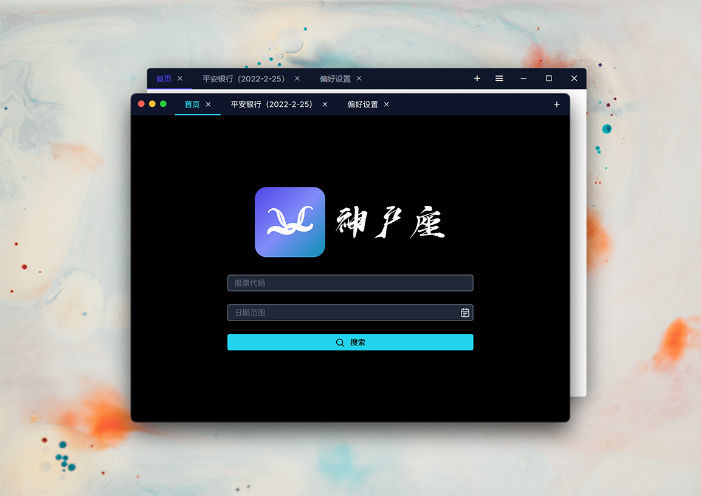

# Kobe

[](../../releases)
[](https://www.codacy.com/gh/ArvinZJC/Kobe/dashboard?utm_source=github.com&utm_medium=referral&utm_content=ArvinZJC/Kobe&utm_campaign=Badge_Grade)
[](https://circleci.com/gh/ArvinZJC/Kobe/tree/main)


[简体中文](./README-zhCN.md) | **English**

> Kobe /'kəubi/
>
> **_n._** a port city in Japan; **the "new" zodiac star sign discovered by Arvin**<sup id="source1">[1](#footnote1)</sup> 😜

Kobe is a macOS/Windows desktop app that can search stocks' strike prices and volumes for users. The supported stock exchanges are Beijing Stock Exchange, Shanghai Stock Exchange, and Shenzhen Stock Exchange. The name Kobe is used because the app's Chinese name contains "神户". The app is primarily designed for a specified part of Chinese users, and contents are displayed in simplified Chinese.

Actually, Kobe was not born in this repository. On 23 July 2020, Kobe was announced to release its first alpha version in [a currently archived repository](https://github.com/ArvinZJC/ShSzStockHelper-Windows). It primarily uses Windows Presentation Foundation (WPF) with .NET Core 3.1, and largely satisfies my family's requirements. Although the old Kobe has done it right after several iterations, its defects become more and more annoying, including supporting Windows only, being extremely slow on the first start, a highly volatile search engine, and so on. Thus, this repository was created on 7 December 2021 to construct an exciting Kobe. Nowadays, the brand-new Kobe is more useful and stabler after refactoring it for some time.

~~For more information, please refer to Kobe's official site and user manual.~~ (under construction)



## ❗ ATTENTION

> May I have your attention pls? 🔥

1. This project is licensed under [the GPL-3.0 License](./LICENSE). By 1 March 2022, everything looks good with Visual Studio Code (Version: 1.64.2) + Node.js 16.13.2 + Vue CLI 4.5.15. Additionaly, I would like to thankfully acknowledge Syncfusion for [its powerful Vue.js UI components library](https://www.syncfusion.com/vue-ui-components) and Tailwind for [its rich and extensible CSS framework and resources](https://tailwindcss.com/resources), which save much development time.
2. Due to [the use of Electron](https://www.electronjs.org/docs/latest/tutorial/support#supported-platforms), Kobe is expected to work well on macOS 10.11 and later (arm64 and x64), and Windows 7 and later (arm64, x64, and x86). **It is awfully safe to permit the app behaviour for any system prompt regarding safety confirmation. The app is signed, is not malware, and will never ever collect and upload any user privacy.** Should you report a problem encountered, you may find [issues](https://github.com/ArvinZJC/Kobe/issues) useful.
3. The primary dependencies of the project are listed in the following table. For more information, please refer to [`package.json`](./package.json).

   | Name                             |  Version   |
   | :------------------------------- | :--------: |
   | @heroicons/vue                   |   1.0.5    |
   | @syncfusion/ej2-vue-buttons      |  19.4.53   |
   | @syncfusion/ej2-vue-calendars    |  19.4.52   |
   | @syncfusion/ej2-vue-dropdowns    |  19.4.52   |
   | @syncfusion/ej2-vue-grids        |  19.4.53   |
   | @syncfusion/ej2-vue-inputs       |  19.4.52   |
   | @syncfusion/ej2-vue-navigations  |  19.4.53   |
   | @syncfusion/ej2-vue-popups       |  19.4.53   |
   | @syncfusion/ej2-vue-splitbuttons |  19.4.52   |
   | cldr-data                        |   36.0.0   |
   | electron                         |   17.1.0   |
   | electron-context-menu            |   3.1.2    |
   | electron-devtools-installer      |   3.2.0    |
   | electron-fetch                   |   1.7.4    |
   | electron-log                     |   4.4.5    |
   | electron-settings                |   4.0.2    |
   | electron-updater                 |   4.6.1    |
   | htmlparser2                      |   7.2.0    |
   | iconv-lite                       |   0.6.3    |
   | smoothscroll-polyfill            |   0.4.4    |
   | tailwindcss                      |   3.0.23   |
   | vue                              |   3.2.31   |
   | vue-class-component              | 8.0.0-rc.1 |
   | vue-cli-plugin-electron-builder  |   2.1.1    |
   | vue-router                       |   4.0.12   |

4. A part of SVG resources in this project are from [Flaticon](https://www.flaticon.com/packs/font-awesome) and [Iconscout](https://iconscout.com/).
5. Vue CLI is a necessary dependency of this project. Assuming the terminal is opened in the project's root directory, the project could be run locally following the steps below using npm. However, you are expected to do some extra work yourself to activate [code signing](https://www.electron.build/code-signing) and [auto update](https://www.electron.build/auto-update).

   - Install all the required dependencies.

     ```sh
     npm install -g @vue/cli  # Optional.
     npm install
     ```

   - Serve/Build the project.

     - To serve it for development,

       ```sh
       npm run electron:serve
       # OR
       npx vue-cli-service electron:serve
       ```

     - To build it for production,

       ```sh
       npm run electron:build
       # OR
       npx vue-cli-service electron:build
       ```

     - _(Recommended)_ If you fancy using the Run and Debug view of Visual Studio Code, you could add the following to the corresponding files to configure the serving and building process.

       - `.vscode/launch.json`：

       ```JSON
       {
         "compounds": [
           {
             "configurations": ["electron: main", "electron: renderer"],
             "name": "electron: debug"
           }
         ],
         "configurations": [
           {
             "name": "electron: dev",
             "request": "launch",
             "runtimeArgs": ["run", "electron:serve"],
             "runtimeExecutable": "npm",
             "skipFiles": ["<node_internals>/**"],
             "type": "node"
           },
           {
             "args": ["--remote-debugging-port=9223", "./dist_electron"],
             "name": "electron: main",
             "outFiles": ["${workspaceFolder}/dist_electron/**/*.js"],
             "preLaunchTask": "electron-debug",
             "protocol": "inspector",
             "request": "launch",
             "runtimeExecutable": "${workspaceRoot}/node_modules/.bin/electron",
             "type": "node",
             "windows": {
               "runtimeExecutable": "${workspaceRoot}/node_modules/.bin/electron.cmd"
             }
           },
           {
             // You should not add this part on Windows because you cannot build macOS desktop apps on Windows.
             "name": "electron: macOS production",
             "request": "launch",
             "runtimeArgs": ["run", "electron:build", "--", "-m"],
             "runtimeExecutable": "npm",
             "skipFiles": ["<node_internals>/**"],
             "type": "node"
           },
           {
             "name": "electron: Windows production",
             "request": "launch",
             "runtimeArgs": [
               "run",
               "electron:build",
               "--",
               "-w",
               "--arm64",
               "--x64"
               "--ia32"
             ],
             "runtimeExecutable": "npm",
             "skipFiles": ["<node_internals>/**"],
             "type": "node"
           },
           {
             "name": "electron: renderer",
             "port": 9223,
             "request": "attach",
             "sourceMapPathOverrides": {
               "webpack:///./src/*": "${webRoot}/*"
             },
             "timeout": 30000,
             "type": "chrome",
             "urlFilter": "http://localhost:*",
             "webRoot": "${workspaceFolder}/src"
           }
         ]
       }
       ```

       - `.vscode/tasks.json`：

       ```JSON
       {
         "tasks": [
           {
             "args": ["electron:serve", "--debug"],
             "command": "./node_modules/.bin/vue-cli-service",
             "isBackground": true,
             "label": "electron-debug",
             "problemMatcher": {
               "background": {
                 "beginsPattern": "Starting development server\\.\\.\\.",
                 "endsPattern": "Not launching electron as debug argument was passed\\."
               },
               "owner": "custom",
               "pattern": {
                 "regexp": ""
               }
             },
             "type": "process",
             "windows": {
               "command": "./node_modules/.bin/vue-cli-service.cmd"
             }
           }
         ],
         "version": "2.0.0"
       }
       ```

6. CircleCI is used to help improve integration and release efficiency. Please refer to [`config.yml`](./.circleci/config.yml) for the primary configurations.

Good luck! 💖

---

<sub id="footnote1">[1.](#source1) Just kidding. Don't take it so seriously! 👮‍♂️</sub>
